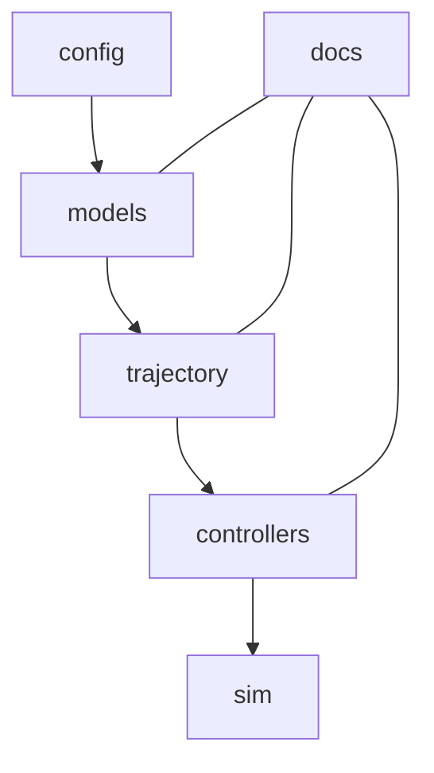

# [PROJECT]: Differential Drive Control Framework
[PURPOSE]:
  差動二輪ロボットの経路追従および目的地点モード制御を統合的に扱うシステム。
  シミュレーションと実機動作の両方を同一設計で検証可能。

[RESPONSIBILITY]:
  - 経路追従モード（Path Following）および目的地点モード（Pose Regulation, Dubins Path）の制御統合。
  - 物理モデル・経路生成・制御則・最適化・シミュレーションの全層構造を明確化。
  - 実機制御 (`RealVehicle`) とシミュレーション (`PhysicsModel`) の切替を統一インターフェースで実現。

[HIERARCHY]:
  - config/      → 定数・パラメータ設定  
  - models/      → 車両運動モデル・幾何計算・実機I/F  
  - trajectory/  → 経路生成と補助演算  
  - controllers/ → 制御アルゴリズム（追従・目的地・適応制御）  
  - sim/         → シミュレーション統合・結果管理  
  - docs/        → 理論、開発方針、仕様ドキュメント群  

---

## 🧭 階層構造の依存マップ（視覚化 + 機械可読）



- **上位層**（controllers, sim）は、**下位層の出力を利用**して動作。  
- **docs** は全体を横断する理論・設計知識を保持。

---

## 🔗 依存関係一覧（AI用構造タグ）

| 上位モジュール | 依存モジュール | 依存種別 | 目的 |
|:--|:--|:--|:--|
| `controllers` | `models.physics` | data | 車両状態更新用 |
| `controllers` | `models.geometry` | math | 誤差計算 |
| `controllers` | `trajectory.utils` | data | 経路点・接線情報取得 |
| `sim` | `controllers` | control | 制御実行 |
| `sim` | `models` | physics | 状態更新 |
| `sim` | `trajectory` | path | 経路入力 |
| `models.physics` | `config.constants` | param | 物理パラメータ参照 |
| `models.real_vehicle` | `config.controller_params` | param | モーター設定 |

---

## ⚙️ 各階層の役割概要

| 階層 | 主な責務 | 代表モジュール | 出力 | 補足 |
|:--|:--|:--|:--|:--|
| `config/` | システム共通パラメータ管理 | constants.py | 定数群 | コード全体で参照される |
| `models/` | 物理・幾何・実機モデル | physics.py, geometry.py | 状態(x, y, θ) | 制御入力を受けて物理挙動を生成 |
| `trajectory/` | 経路生成・補間・姿勢情報算出 | planner.py, utils.py | 経路点列, 曲率 | 経路データの中間表現層 |
| `controllers/` | 制御アルゴリズム全般 | path_follow.py, pose_regulation.py | (v, δ) | 経路情報＋誤差に基づき入力生成 |
| `sim/` | 統合実行とモード管理 | simulation.py, vehicle_manager.py | ログ, 状態履歴 | 全層を束ねる実行エントリ |
| `docs/` | 理論・開発方針・仕様 | control_theory.md, development_policy.md | 設計知識 | コード外部知識として参照 |

---

## 🧠 AI補助向けメモ
- **AIにとっての解析ルート**  
  1. `STRUCTURE.md` → 全体構造の依存と責務を把握  
  2. 各階層の md (`controllers.md`, `models.md` …) を参照して関数粒度に降りる  
  3. `docs/control_theory.md` を参照して数理的根拠を確認  

- **解析モード例**
  - 「制御則の改善」 → `controllers` と `models.geometry` を中心に分析  
  - 「経路復帰動作の調整」 → `trajectory` と `controllers.pose_regulation`  
  - 「物理モデル差異（実機 vs sim）」 → `models.physics` と `models.real_vehicle`  
  - 「最適化アルゴリズム調整」 → `controllers.pso_adapt` と `docs/optimization.md`

---

## 🧩 今後の拡張予定
- `/learning/` ディレクトリを追加し、強化学習・PSO比較実験を管理予定。  
- 実機センサー統合層 `/sensors/` の新設（IMU, 磁気センサー対応）。  
- `/tests/` に統合回帰テストを追加し、再現性を自動確認。

---

## 🗂️ 管理方針（人間とAIの共通理解）

| 種別 | 管理対象 | 変更単位 | 更新ルール |
|:--|:--|:--|:--|
| コード | `.py` 各階層 | 関数単位 | VSCodeで開発・Git管理 |
| 構造情報 | 各階層の `.md` | ファイル単位 | コード変更時に更新 |
| 理論／方針 | `docs/` | 章単位 | 理論更新やアルゴリズム追加時 |
| 全体構造 | `STRUCTURE.md` | 階層単位 | 階層追加・削除時に更新 |

---

## ✅ 要約
> **STRUCTURE.md はプロジェクト全体の「構造＋依存＋責務」を示す唯一の俯瞰図。**  
> 人間にとっては「全体像の入口」、AIにとっては「構造理解の起点」。

---

## [STRUCTURE OVERVIEW]

```
project/
├── config/
│   └── config.md
├── controllers/
│   └── controllers.md
├── models/
│   ├── interfaces.py          ← 共通インターフェース（新規）
│   ├── physics.py
│   └── real_vehicle/
│       ├── real_vehicle.py
│       └── param_defs.py      ← パラメータ定義（旧param_ids.py統合）
├── sim/
│   └── simulation.py
├── trajectory/
│   └── trajectory_loader.py
└── docs/
    ├── STRUCTURE.md
    ├── control_theory.md
    ├── models.md
    └── sim.md
```

---

## [UPDATE LOG]
- **2025-10-09**  
  - `models/interfaces.py` を新規追加。  
  - `real_vehicle/param_defs.py` を `param_ids.py` から移動・再構成。  
  - `simulation.py` が `VehicleInterface` に基づき動的切替に対応。
